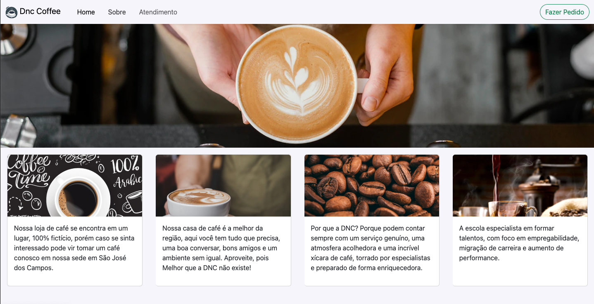
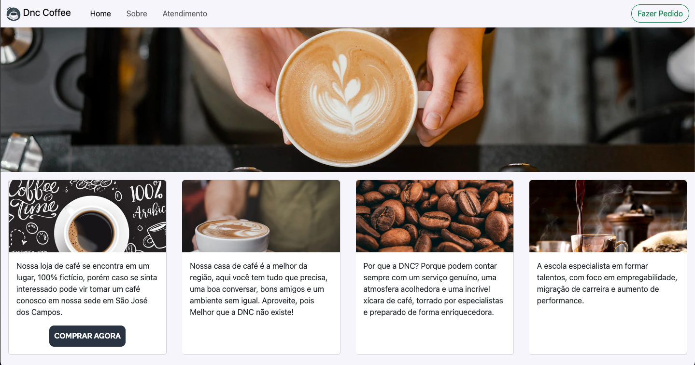
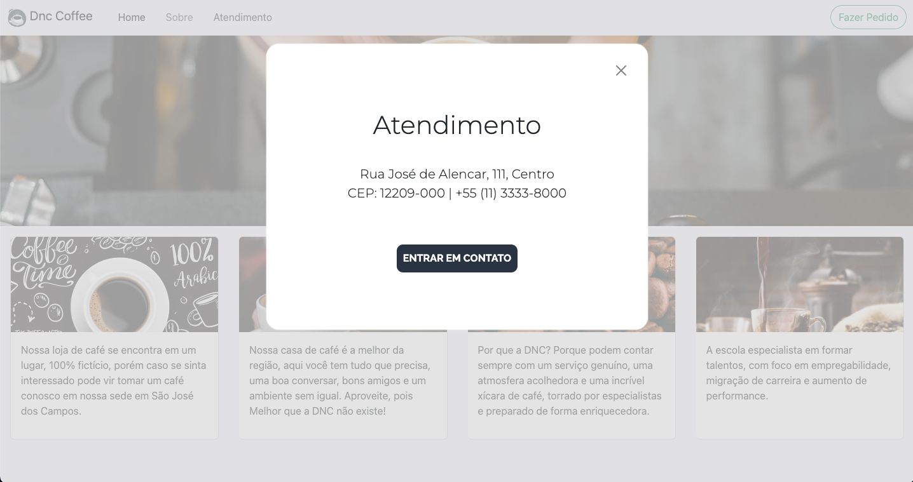

# DNC Coffee ☕️ 

## 🔥 To do:
 The company DNC hired you to give some "life" on the elements from a Cafeteria website, it's necessary develop some features.

 It was necessary to show a button when the user pass the mouse on card, and open a custom modal using Javascript to get information about the cafeteria.

 The Figma's project was already given. 

 ## 😜 What I've learned working on this project:
 <ul>
  <li> ✅  How to create modals from zero. </li>
  <li> ✅  Create functions to open and close modal using querySelector </li>
  <li> ✅  Work with Event listener to close modal when clicked out of it </li>
 </ul>

 ## ⚡️ Techs:
  <ul>
  <li> ✅  <a href="https://getbootstrap.com/" target="_blank">Bootstrap</a> installed by <a href="https://www.npmjs.com/" target="_blank">NPM</a> (Node Package Manager) </li>
  <li> ✅  <a href="https://developer.mozilla.org/pt-BR/docs/Web/JavaScript" target="_blank">Javascript</a> </li>
  <li> ✅  <a href="https://developer.mozilla.org/pt-BR/docs/Web/CSS" target="_blank">CSS</a> </li>
 </ul>
 

 Hope you enjoy as much as I have! ⭐

 ### Screenshots:

 
 
 

